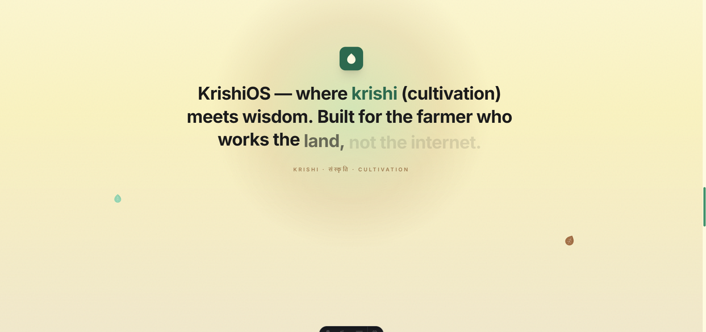
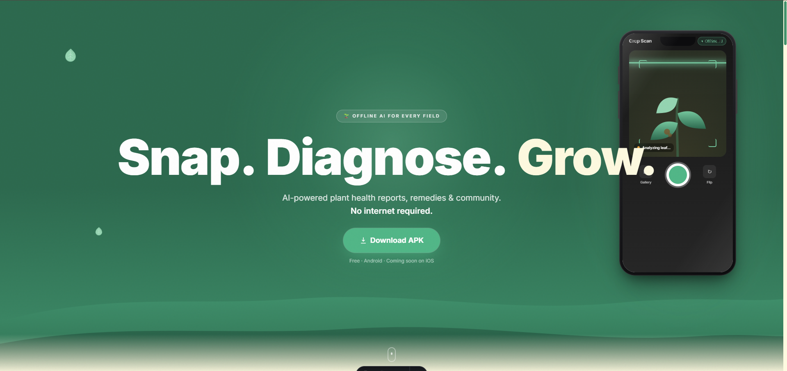
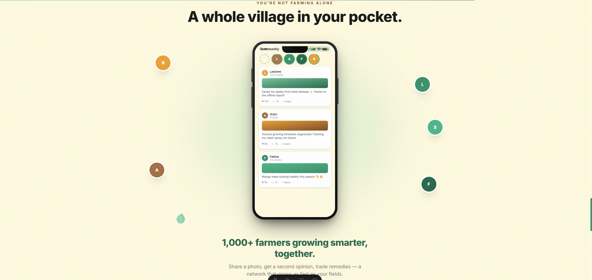

# KrishiOS Monorepo

KrishiOS is a production-grade, offline-first AI farming assistant platform designed to assist smallholder farmers in remote areas. It leverages Edge Computer Vision (PyTorch/TorchScript) and FastAPI to diagnose crop diseases and suggest recovery steps entirely offline.

---

## 📸 App Showcase & Screenshots
<p align="center">
  
  
</p>
<p align="center">
  
  
</p>
<p align="center">
  
</p>

---

## ⚡ Features
*   **Edge AI Diagnostics**: Classifies crop leaf images locally using a PyTorch model compiled to TorchScript to diagnose 38 distinct plant-disease states.
*   **Dynamic Geolocation Weather**: Emits real-time localized forecasts and warnings via the device GPS and Open-Meteo API.
*   **Farmer Discussions**: Real-time forum threads powered by Cloud Firestore and secure cache caches.
*   **Encrypted Offline Cache**: Uses AES-256 encrypted Hive local databases.

---

## 🛠️ Technology Stack
*   **Frontend**: Flutter (Dart) using Riverpod State Management and Hive caches.
*   **Backend**: FastAPI (Python) web server using Uvicorn.
*   **Artificial Intelligence**: PyTorch CPU TorchScript models.
*   **Cloud Infrastructure**: Firebase Auth, Firestore, and Storage.

---

## 🏛️ System Architecture

```
[Flutter Mobile/Web Client] <---> [FastAPI REST Server] <---> [TorchScript Model]
           |
           +---> [Firebase Auth & Storage & Firestore]
```

For complete sequence diagrams, see [ARCHITECTURE.md](docs/ARCHITECTURE.md).

---

## 📂 Project Directory structure

```
KrishiOS/
│
├── ai/                # AI model notebooks and weights
├── backend/           # FastAPI REST API backend
├── frontend/          # Flutter mobile application
├── web/               # Vite-based HTML/CSS landing page
├── docs/              # Detailed development documentation
├── deployment/        # Docker and release build configs
├── scripts/           # Maintenance scripts
└── README.md          # Root repository readme
```

---

## 🚀 Quick Start (Running Locally)

### 1. Backend Server
```bash
cd backend
python -m venv .venv
source .venv/bin/activate
pip install -r requirements.txt
python app.py
```

### 2. Vite Product Landing Page
```bash
cd web
npm install
npm run dev
```

### 3. Flutter Client App
```bash
cd frontend
flutter pub get
flutter run
```

---

## 💻 Platform Support & Limitations

| Platform | Diagnostic Inference | Community Forum | Weather Alerts | Offline Mode |
| :--- | :--- | :--- | :--- | :--- |
| **Android** | Supported (Real AI API) | Supported (Firestore) | Supported (GPS) | Supported (Hive Cache) |
| **iOS** | Supported (Real AI API) | Supported (Firestore) | Supported (GPS) | Supported (Hive Cache) |
| **Web** | Supported (CORS API) | Supported (Firestore) | Mock Coordinates | Supported (Browser Cache)|
| **Desktop** | Supported (Local API) | Supported (Firestore) | Mock Coordinates | Supported (Hive Cache) |

---

## 📚 Technical Documentation Index

Please consult the documents inside the `docs/` folder for comprehensive integration, code guidelines, and deployment specifications:

| Document | Description | Path Link |
| :--- | :--- | :--- |
| **Installation Guide** | Walkthrough instructions for Windows, macOS, and Linux | [docs/INSTALLATION.md](docs/INSTALLATION.md) |
| **System Architecture** | Diagrams detailing backend request data flows | [docs/ARCHITECTURE.md](docs/ARCHITECTURE.md) |
| **Project Structure** | Monorepo directories index and descriptions | [docs/PROJECT_STRUCTURE.md](docs/PROJECT_STRUCTURE.md) |
| **Developer Guidelines** | Clean architecture folders and Riverpod rules | [docs/DEVELOPMENT.md](docs/DEVELOPMENT.md) |
| **API Documentation** | REST HTTP request and response structures | [docs/API.md](docs/API.md) |
| **Database Guide** | Cloud Firestore structures and Hive caches | [docs/DATABASE.md](docs/DATABASE.md) |
| **AI System** | JIT compilation metrics and model parameters | [docs/AI.md](docs/AI.md) |
| **Deployment Guide** | Compiling releases for APK/AAB and iOS | [docs/DEPLOYMENT.md](docs/DEPLOYMENT.md) |
| **Troubleshooting** | Solutions for camera, port, and emulator bugs | [docs/TROUBLESHOOTING.md](docs/TROUBLESHOOTING.md) |
| **Roadmap** | Feature metrics and future enhancements | [docs/ROADMAP.md](docs/ROADMAP.md) |
| **Contribution Guide** | Guidelines for branch styles and PR structures | [docs/CONTRIBUTING.md](docs/CONTRIBUTING.md) |
| **Security Policy** | Security rules for storage bucket authorization | [docs/SECURITY.md](docs/SECURITY.md) |
| **License Specification** | MIT License terms | [docs/LICENSE.md](docs/LICENSE.md) |
| **FAQ** | 30 frequently asked developer questions | [docs/FAQ.md](docs/FAQ.md) |

---

## 👥 Core Team (4 Brains)
*   **Sneha** (Team Leader)
*   **Biswajit** (AI Development)
*   **Paarshivi** (Frontend Development)
*   **Zoro** (AI Development & Backend Integration)

---

## 📄 License
This repository is licensed under the terms of the MIT License. See [docs/LICENSE.md](docs/LICENSE.md) for details.
