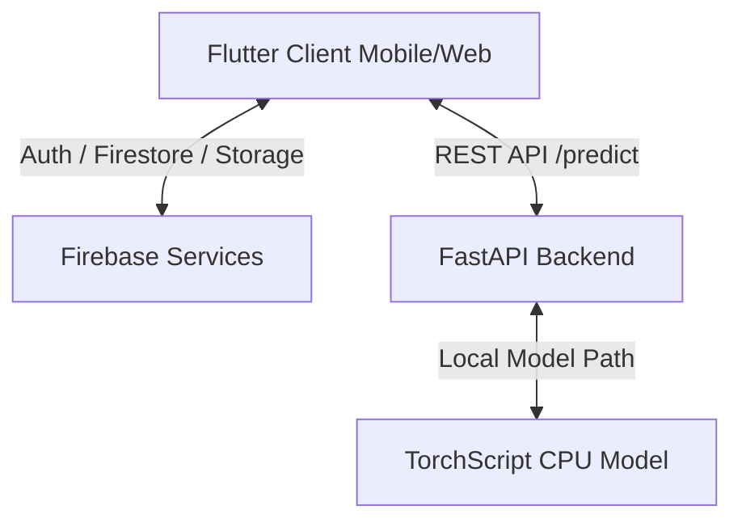
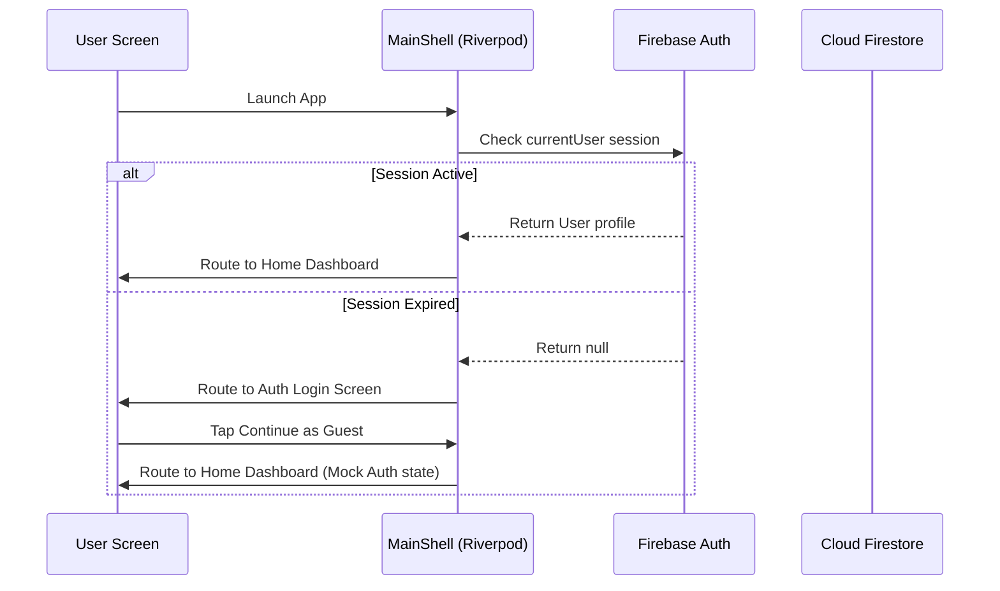
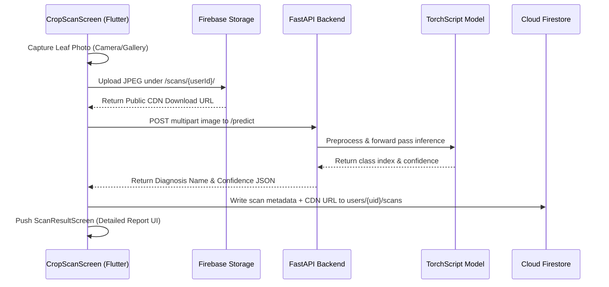
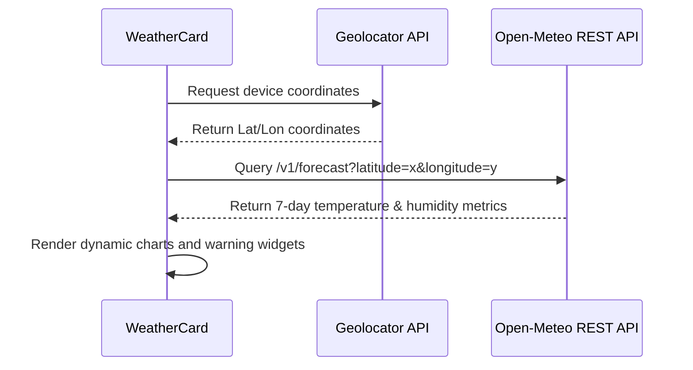
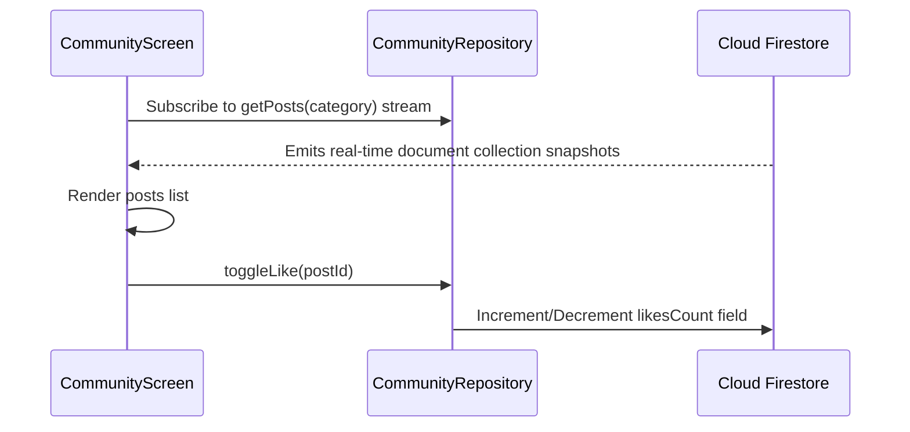

# System Architecture

This document describes the high-level architecture, data flows, and sub-system integrations of the KrishiOS Monorepo.

---

## 🏗️ System Components

KrishiOS is divided into three key layers:
1.  **Client Application (Frontend)**: Flutter cross-platform app (Android/iOS/Web) compiled using clean architecture principles and Riverpod state management.
2.  **Cloud & Database Layer (Firebase)**: Manages cloud storage buckets, document models, and security permissions.
3.  **Inference Server (AI Backend)**: FastAPI microservice exposing PyTorch endpoints to process leaf pathology classifications.

---

## 🔄 Core Flows

### 1. Authentication Flow
Authenticates user sessions or allows Guest mode bypasses.

### 2. Crop Scan Flow
The process of capturing, classifying, and saving crop diagnostic results.

### 3. Weather Flow
Geolocation coordinates weather alerts.

### 4. Community forum Flow
Dynamic comment listing and updates.

